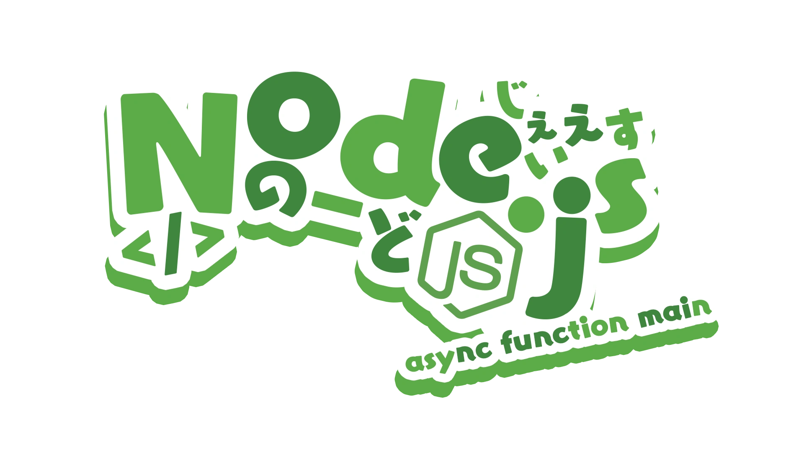

<p align="center">
  
</p>

<h1 align="center"><em><b>rustplusplus</b> ~ Rust+ Discord Bot (Fork)</em></h1>

<p align="center">
A trimmed, focused fork of <a href="https://github.com/alexemanuelol/rustplusplus">alexemanuelol/rustplusplus</a> with selected
fixes from <a href="https://github.com/FaiThiX/rustplusplus">FaiThiX/rustplusplus</a> and custom features for small,
active raid groups.
</p>

<p align="center">
For setup, pairing and credential instructions see the <a href="https://github.com/alexemanuelol/rustplusplus">upstream repository</a>.
</p>

---

## Headline features in this fork

### (◉‿◉) Smarter tracker

- **`/tracker add|remove|list`** slash command with **native Discord autocomplete** on both the tracker and player options. Player search merges the bot's online cache with a Battlemetrics server-scoped lookup, raced against Discord's 3-second budget.
- **Active-hours hint** next to each tracked player (e.g. `~18–23 daily`), computed from a local SQLite log of polling snapshots aggregated over 30 days.
- **Group active-window line** in the tracker embed showing roughly when the whole group plays.
- **Off-hours RAID ALERT** (per-tracker opt-in): when ≥60 % of the tracker is online during a quiet hour, fires `@everyone` in Discord and a force-message in team chat, with a 30 min cooldown.
- Player rows now show **plain name + small B / S markdown links** to Battlemetrics and Steam profiles.
- Modal accepts a plain ID **or** a full Steam/BM profile URL.

### ┌[¯|¯]┘ Cargo Ship lifecycle (slim port of FaiThiX 421aa27)

- Full state machine: **docking → docked → undocking → leaving**, each with its own toggleable Discord notification.
- **Locked-crate spawn alerts** for each of the 3 expected spawns on the ship.
- Multi-harbor visit tracking; "undocking soon" 70-second warning.
- New in-game commands: **`!cargo`** (rich per-ship summary) and **`!cargo timer`** (sorted list of pending timers).
- Direction-based "is leaving" fallback for maps without harbors.

### (°ロ°)! Smart Alarm RF event tagging

Tag a Smart Alarm in the Edit modal with an event name (e.g. `Large Excavator`, `Cargo Ship`). When the linked RF receiver
fires, the bot announces **both start AND stop** in the activity channel and team chat — perfect for tracking
powered in-game events the Rust+ API doesn't expose directly.

### (=・ω・)ﾉ Translated team chat channel

A dedicated `teamchat-translated` channel that automatically translates non-English/German player messages into English.
Detection is fully offline (`franc-min`). A **bundled LibreTranslate** with the Spanish → English model ships inside the
Docker image and handles all Spanish lines locally — no rate limits, no API key, no external container. Other detected
languages fall back to the `translate` package's free Google web endpoint. Toggleable in settings, defaults to off.

### (•‿•) Other quality-of-life

- Smart switch on/off announcements bypass the in-game mute (same fix as Smart Alarms in v1.25.5).
- Battlemetrics request queue + 0–30 s poll-cycle jitter — no more burst rate-limit hits with many servers.
- Steam profile name scraping throttled to once per 24 h per player.
- Day/night transition broadcasts (`It's getting dark!` / `It's getting light!`).
- Battlemetrics upcoming wipes display in server embed.
- Alarm-triggered switch groups (auto-activate after N triggers).
- Shorthand `!timer <time> [message]` (no `add` subcommand needed).
- Asset-path monument tokens are no longer drawn over the map.

### ┐(￣ヘ￣)┌ Slimmed for focus

Removed features the fork's target audience doesn't use:
- RustLabs lookup commands (`!craft / decay / despawn / recycle / research / stack / upkeep`) and their 21 MB of data — use rustlabs.com instead.
- Vending-machine item-subscription system (new-vending-machine markers still announce).
- CCTV codes command.
- In-game `!tts` and Discord `sendTTSMessage`.
- Battlemetrics "all online players" info-channel widget.

---

## Deploying

Pull a versioned image from this fork's GHCR:

```yaml
services:
  rustplusbot:
    image: ghcr.io/zuescho/rustplusplus:tracker-autocomplete-activity
    environment:
      - RPP_DISCORD_TOKEN=TOKEN
      - RPP_DISCORD_CLIENT_ID=CLIENT_ID
    volumes:
      - ./logs:/app/logs
      - ./instances:/app/instances
      - ./credentials:/app/credentials
      - ./maps:/app/maps
    restart: unless-stopped
```

The image bundles a minimal LibreTranslate (Spanish → English only) on `127.0.0.1:5000`, started by the container's own entrypoint. Translation works out of the box — no sidecar, no API key, no network calls. To use an external LibreTranslate instead, set `RPP_LIBRETRANSLATE_URL=http://your-host:5000` at run time; setting it to an empty string disables the libre path entirely and falls back to the (rate-limited) free Google web endpoint.

Existing `instances/*.json` files are migrated in place — paired alarms, switches, trackers, settings and channel IDs all survive upgrades.

---

## Configuration & custom settings

The bot is configured in three places: **environment variables** (process-wide,
set at deploy time), the **Discord `settings` channel** (per-guild toggles the
bot renders as buttons/selects), and **per-device / per-tracker** controls
exposed in each entity's embed. The settings below are the ones this fork adds
or changes relative to [upstream](https://github.com/alexemanuelol/rustplusplus);
everything upstream documents still applies.

### Environment variables

All variables are prefixed `RPP_`. Only the two Discord credentials are
required; the rest have sensible defaults.

| Variable | Default | Description |
| --- | --- | --- |
| `RPP_DISCORD_TOKEN` | — | **Required.** Discord bot token. |
| `RPP_DISCORD_CLIENT_ID` | — | **Required.** Discord application (client) ID. |
| `RPP_DISCORD_USERNAME` | `rustplusplus` | Display name the bot registers under. |
| `RPP_NEED_ADMIN_PRIVILEGES` | `true` | When `true`, only Discord admins can delete servers/switches, manage credentials and reset channels. Set to the string `false` to allow non-admins. |
| `RPP_POLLING_INTERVAL` | `10000` | Rust+ poll interval in ms. Lower = faster reactions, more API traffic. |
| `RPP_RECONNECT_INTERVAL` | `15000` | Delay in ms before reconnecting after a dropped Rust+ connection. |
| `RPP_BM_REQUEST_SPACING_MS` | `1500` | **Fork.** Minimum gap in ms between two Battlemetrics API requests in the global queue. Raise it to spread the per-cycle burst of server polls over a wider window when many trackers trip Battlemetrics rate limits. |
| `RPP_BM_REQUEST_JITTER_MS` | `1500` | **Fork.** Extra random delay (0…this) added on top of the spacing for each Battlemetrics request, so calls don't fire on a fixed cadence. |
| `RPP_STEAM_SCRAPE_DELAY_MS` | `1500` | **Fork.** Base delay in ms between background Steam profile-name scrapes. The actual wait is randomised between this and 2× this value, spreading the per-player scrape burst so Steam stops 429-ing large trackers. |
| `RPP_LOG_CALL_STACK` | `false` | Set to the string `true` to include call-stack traces in error logs. |
| `RPP_LIBRETRANSLATE_URL` | _(bundled)_ | **Fork.** LibreTranslate base URL for the translated team-chat channel. The Docker image runs a bundled instance on `127.0.0.1:5000` by default. Point at an external instance to override; set to an empty string to disable the LibreTranslate path entirely (falls back to the rate-limited Google web endpoint). |
| `RPP_LIBRETRANSLATE_API_KEY` | _(empty)_ | **Fork.** API key for the LibreTranslate instance above, if it requires one. |

> Note: `RPP_NEED_ADMIN_PRIVILEGES` and `RPP_LOG_CALL_STACK` are parsed as
> strict booleans — the bot compares the value to the literal string `true`/`false`,
> so `RPP_NEED_ADMIN_PRIVILEGES=false` actually disables the check.

### Discord `settings` channel — fork-added toggles

These appear as buttons/selects in the guild's `settings` channel. New or
changed in this fork:

| Setting | Default | What it does |
| --- | --- | --- |
| **In-game command access mode** (`inGameCommandAccessMode`) | `blacklist` | Switch in-game command gating between `blacklist` and `whitelist` mode (see the `/blacklist` and `/whitelist` slash commands). |
| **Smart Alarm bypass mute** (`smartAlarmBypassMute`) | `true` | Smart Alarm announcements are still sent to in-game team chat even while the bot is muted in-game. |
| **Custom Alarm bypass mute** (`customAlarmBypassMute`) | `false` | Same bypass for the RF-event "custom alarm" announcements (see Smart Alarm RF event tagging). |
| **Smart Switch bypass mute** (`smartSwitchBypassMute`) | `true` | Smart Switch on/off announcements bypass the in-game mute. |
| **Battlemetrics upcoming wipes** (`displayInformationBattlemetricsUpcomingWipes`) | `false` | Show Battlemetrics-reported upcoming wipes in the server info embed. |
| **Team-chat translation** (`teamChatTranslateEnabled`) | `false` | Enable the `teamchat-translated` channel that translates non-EN/DE player messages to English. |
| **Mention user IDs** (`mentionUserIds`) | `[]` | Discord user IDs to `@`-mention on raid/alert events. |

### Event notification toggles — fork-added

Each event in the `settings` channel has an independent **Discord** and
**in-game** toggle. The fork adds the full Cargo Ship lifecycle and the Deep
Sea events:

| Event setting | Notes |
| --- | --- |
| `cargoShipDockingAtHarborSetting` | Ship approaching a harbor. |
| `cargoShipDockingSetting` / `cargoShipDockedSetting` | State-machine: docking → docked. |
| `cargoShipUndockingSetting` | Ship undocking; pairs with the 70 s "undocking soon" warning. |
| `cargoShipLeavingSetting` | Ship leaving the harbor / map. |
| `cargoShipLockedCrateSpawnedSetting` | Each of the 3 expected locked-crate spawns on the ship. |
| `deepSeaDetectedSetting` / `deepSeaLeftMapSetting` | Deep Sea monument appear/leave (ported from FaiThiX). |

Related in-game commands: **`!cargo`** (rich per-ship summary) and
**`!cargo timer`** (sorted list of pending timers).

### Per-tracker setting — Pause tracking (ACTIVE / PAUSED)

Each tracker embed has an **ACTIVE / PAUSED** button (stored as `active` on the
tracker, default on). Click it to **pause** a tracker: while paused the bot makes
**no API calls** for it at all — no Battlemetrics server poll and no per-player
Steam profile scrape — and its linked Battlemetrics instance is torn down on the
next poll cycle (unless the active server or another *active* tracker still needs
the same server). This is the lever for staying under Battlemetrics/Steam rate
limits when you're tracking a lot of players: pause the trackers you don't need
live right now and re-enable them on demand. The tracker embed shows a
`Tracking: PAUSED ⏸️` line so paused trackers are obvious at a glance. Existing
trackers from before this field default to active.

### Per-tracker setting — Off-hours RAID ALERT

Each tracker embed has a **RAID ALERT** button (stored as `raidAlert` on the
tracker, default off). When enabled and the tracker has ≥2 players, the bot
fires an `@everyone` Discord alert plus a forced in-game team-chat message when
**≥60 %** of the tracker is online during a statistically *quiet* hour for the
group, with a **30-minute** cooldown. The "quiet hour" determination uses the
local SQLite activity log (a group hour counts as off-peak below the **20 %**
activity threshold). Thresholds are defined in
`src/handlers/battlemetricsHandler.js`.

### Per-Smart-Alarm setting — RF event tag

In a Smart Alarm's **Edit** modal, the **event tag** field (`eventTag`) lets you
name the in-game event the alarm's RF receiver is wired to (e.g. `Large Excavator`,
`Cargo Ship`). When set, the bot announces **both the start and the stop** of
that event in the activity channel and team chat — useful for powered events the
Rust+ API doesn't expose directly.

---

## Thanks

- **[liamcottle](https://github.com/liamcottle)** — for the [rustplus.js](https://github.com/liamcottle/rustplus.js) library.
- **[alexemanuelol](https://github.com/alexemanuelol)** — for the [main rustplusplus bot](https://github.com/alexemanuelol/rustplusplus).
- **[FaiThiX](https://github.com/FaiThiX)** — for the Deep Sea features, cargo lifecycle work, and map fixes.
- **.Vegas.#4844** on Discord — for the icons.
