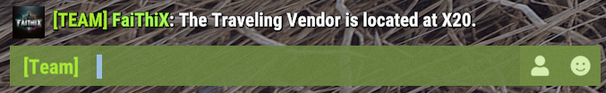

# Commands

> Commands can be executed via Discord or In-Game Team Chat. To use Slash Commands in Discord, you must be in the role configured via `/role` (or have no role configured, in which case anyone can use them). In-Game commands work from Team Chat only (not global chat), and can also be issued from the Discord `commands` text-channel.

- [Discord Slash Commands](#discord-slash-commands)
- [In-Game Commands](#in-game-commands)

---

# Discord Slash Commands

| Command | Description |
| --- | --- |
| [**/alarm**](#alarm) | Edit a Smart Alarm (name, message, command, image, **event tag**). |
| [**/alias**](#alias) | Create custom aliases for commands. |
| [**/blacklist**](#blacklist) | Block a user from using the bot. |
| [**/credentials**](#credentials) | Add/remove FCM credentials for an account. |
| [**/help**](#help) | Show help links. |
| [**/ingameaccess**](#ingameaccess) | Allow/deny specific users for in-game commands. |
| [**/item**](#item) | Look up an item by name or ID. |
| [**/leader**](#leader) | Transfer team leadership. |
| [**/map**](#map) | Show the server map image. |
| [**/players**](#players) | Battlemetrics player lookup. |
| [**/reset**](#reset) | Reset Discord channels managed by the bot. |
| [**/role**](#role) | Set/clear the role required to use the bot. |
| [**/storagemonitor**](#storagemonitor) | Edit a Storage Monitor's image. |
| [**/switch**](#switch) | Edit a Smart Switch's image. |
| [**/tracker**](#tracker) | **Add, remove or list players on a tracker (with autocomplete).** |
| [**/uptime**](#uptime) | Show bot and server uptime. |
| [**/whitelist**](#whitelist) | Manage the bot whitelist. |

## /alarm

Edit a Smart Alarm.

| Subcommand | Option | Description |
| --- | --- | --- |
| `edit` | `id` | The ID of the Smart Alarm. *(required)* |
| | `image` | Image used in the embed. *(required)* |

You can also click the **Edit** button on an alarm in the `alarms` channel to set its name, message, command, and the new **Event tag** field. When an event tag is set (e.g. `Large Excavator`), the alarm announces both start AND stop in the activity channel and team chat — useful for RF-receiver-driven events.

## /alias

| Subcommand | Option |
| --- | --- |
| `add` | `alias`, `value` |
| `remove` | `index` |
| `show` | |

## /blacklist

| Subcommand | Option |
| --- | --- |
| `add` | `discord_user` and/or `steamid` |
| `remove` | `discord_user` and/or `steamid` |
| `show` | |

## /credentials

Pair FCM credentials so the bot can receive Rust+ push notifications.

| Subcommand | Option |
| --- | --- |
| `add` | `gcm_android_id`, `gcm_security_token`, `steam_id`, `issued_date`, `expire_date`, optional `hoster` |
| `remove` | `steam_id` *(optional)* |
| `show` | |
| `set_hoster` | `steam_id` *(optional)* |

See [Credentials](credentials.md).

## /help

Posts links to the docs.

## /ingameaccess

Per-Steam-ID gate for the in-game command interface.

## /item

Look up an item by name or ID. Returns a minimal item card (title + ID). For detailed item stats — recipes, decay, recycle output, etc. — use **[rustlabs.com](https://rustlabs.com)** directly; the RustLabs lookup commands were removed from this fork.

| Option | Description |
| --- | --- |
| `name` | Item name (fuzzy-matched). |
| `id` | Numeric item ID. |

## /leader

Give or take team leadership from a member.

## /map

| Subcommand | Description |
| --- | --- |
| `all` | Monuments + markers. |
| `clean` | No overlays. |
| `monuments` | Monument names only. |
| `markers` | Markers only. |

## /players

Battlemetrics-backed player lookup. Search by name or by player ID; optionally scoped to a specific Battlemetrics server.

## /reset

Recreates channels managed by the bot. Useful after a bot upgrade if a channel's layout looks stale.

## /role

Limit (or open) bot usage to a specific Discord role.

| Subcommand | Description |
| --- | --- |
| `set` | Set the role. *(required: `role`)* |
| `clear` | Anyone can use the bot. |

## /storagemonitor

Edit a Storage Monitor's image (button-driven UI lives in the `storagemonitors` channel).

## /switch

Edit a Smart Switch's image (button-driven UI lives in the `switches` channel).

## /tracker

**Native Discord autocomplete on both options** — start typing and pick from the dropdown.

| Subcommand | Option | Description |
| --- | --- | --- |
| `add` | `tracker` | Pick the tracker. Autocomplete suggests trackers by name. |
| | `player` | Pick a player. Autocomplete merges the bot's online cache with a Battlemetrics search scoped to the tracker's server. |
| `remove` | `tracker` | Pick the tracker. |
| | `player` | Autocomplete suggests only players currently on that tracker. |
| `list` | `tracker` *(optional)* | List trackers, or list one tracker's players. |

The legacy "Add player" button + modal in the `trackers` channel still works for pasting raw IDs or full Steam / Battlemetrics URLs.

## /uptime

| Subcommand | Description |
| --- | --- |
| `bot` | Bot uptime. |
| `server` | Connected server uptime. |

## /whitelist

Steam ID whitelist for the in-game command interface.

---

# In-Game Commands

Use a `!` prefix in team chat (the prefix is configurable in the settings channel).

| Command | Description |
| --- | --- |
| [**afk**](#afk) | Teammates inactive (no movement) for >5 min. |
| [**alive**](#alive) | Player with the longest time alive — or a specific teammate. |
| [**cargo**](#cargo) | **Rich Cargo Ship summary; subcommands for timers.** |
| [**chinook**](#chinook) | Chinook 47 location / last seen. |
| [**connection** / **connections**](#connection--connections) | Recent team connection events. |
| [**death** / **deaths**](#death--deaths) | Recent team death events. |
| [**deepsea**](#deepsea) | Deep Sea event status. |
| [**events**](#events) | Recent in-game events (filterable: cargo, heli, small, large, chinook). |
| [**heli**](#heli) | Patrol Helicopter location / last on map / last destroyed. |
| [**large**](#large) | Large Oil Rig crate timer. |
| [**leader**](#leader-1) | Take or give leadership. |
| [**marker** / **markers**](#marker--markers) | Personal map markers. |
| [**mute**](#mute) | Mute the bot in team chat (Smart Alarms still announce). |
| [**note** / **notes**](#note--notes) | Personal notes. |
| [**offline** / **online**](#offline--online) | Offline/online teammates. |
| [**player** / **players**](#player--players) | Battlemetrics info on currently-online players. |
| [**pop**](#pop) | Server population (current / queue / max). |
| [**prox**](#prox) | Distance to closest teammates. |
| [**send**](#send) | Send a Discord DM to a configured user. |
| [**small**](#small) | Small Oil Rig crate timer. |
| [**steamid**](#steamid) | Get a teammate's Steam ID. |
| [**team**](#team) | List team members. |
| [**time**](#time) | In-game time + time until day/night. |
| [**timer** / **timers**](#timer--timers) | Personal countdown timers. |
| [**tr**](#tr) | Translate text to another language. |
| [**trf**](#trf) | Translate text between two languages. |
| [**unmute**](#unmute) | Unmute the bot in team chat. |
| [**uptime**](#uptime-1) | Bot + server uptime. |
| [**vendor**](#vendor) | Traveling Vendor location. |
| [**wipe**](#wipe) | Time since the last wipe. |

## afk

`!afk` — inactive teammates (no XY movement for >5 min).

## alive

`!alive` — longest-alive teammate.
`!alive <name>` — alive time for a teammate.

## cargo

Rich Cargo Ship intel. With no subcommand, returns a per-ship summary including current state (sailing / docking / docked / undocking / leaving) and the most relevant pending timer.

| Form | Description |
| --- | --- |
| `!cargo` | Per-ship summary line. |
| `!cargo timer` | Sorted list of all pending cargo timers (locked-crate spawn, undocking-soon, egress, leaves-map). |

## chinook

`!chinook`

## connection / connections

`!connections` — recent connect/disconnect events for the team.
`!connection <name>` — events for a specific teammate.

## death / deaths

`!deaths` — recent deaths for the team.
`!death <name>` — deaths for a specific teammate.

## deepsea

Deep Sea event status (location and ETA).

## events

`!events` — last 5 events.
`!events 3` — last 3.
`!events cargo` — last 5 from one type.
`!events cargo 2` — last 2 from one type.

Filterable types: `cargo`, `heli`, `small`, `large`, `chinook`.

## heli

`!heli`

## large

`!large`

## leader

`!leader` — claim leadership.
`!leader <name>` — give leadership to a teammate.

## marker / markers

| Form | Description |
| --- | --- |
| `!marker add <name>` | Add a marker at current location. |
| `!marker remove <id>` | Remove a marker. |
| `!marker <name>` | Navigate back to a marker (sets a personal map pin). |
| `!markers` | List all your markers. |

## mute

`!mute` — silences most bot chatter in team chat. Smart Alarms, raid alarms, and tagged-alarm events still bypass the mute.

## note / notes

| Form | Description |
| --- | --- |
| `!note add <text>` | Add a note. |
| `!note remove <id>` | Remove a note. |
| `!notes` | List all notes. |

## offline / online

`!offline`, `!online`

## player / players

`!players` — all currently-online players on the server (Battlemetrics).
`!player <name>` — info for a specific player.

## pop

`!pop`

## prox

`!prox` — distance to the three closest teammates.
`!prox <name>` — distance to a specific teammate.

## send

`!send <discord-user> <message>` — DM a configured Discord user.

## small

`!small`

## steamid

`!steamid <name>`

## team

`!team`

## time

`!time` — in-game time and time until day/night.

## timer / timers

| Form | Description |
| --- | --- |
| `!timer <time> [message]` | Shorthand form — no `add` subcommand needed. |
| `!timer add <time> <text>` | Long form. |
| `!timer remove <id>` | Remove a timer. |
| `!timers` | List all timers. |

Time format: `2h15m`, `15m10s`, etc. — no spaces between units.

## tr

`!tr <language-code> <text>` — translate text *to* a language.
`!tr language <language-name>` — get the ISO code for a language name.

## trf

`!trf <from> <to> <text>` — translate text from one language to another.

## unmute

`!unmute`

## uptime

`!uptime` — bot + connected-server uptime.

## vendor

`!vendor`

## wipe

`!wipe`

